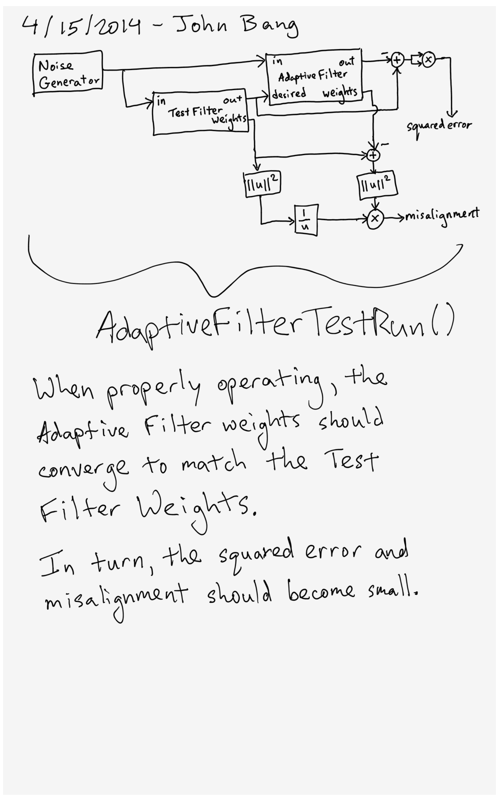
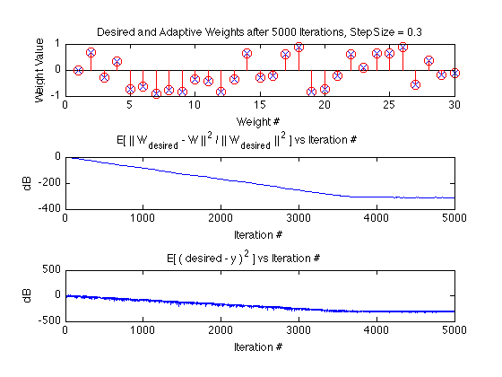

# Least-Mean-Square Adaptive Filter in Matlab and C
*4/15/2014 - J. Bang*

In April 2014, as a follow up to an interview, I decided to code a simple floating point NLMS Adaptive Filter and an accompanying test routine as an exercise, starting with a Matlab prototype followed by a C implementation. Putting it here as-is.

## What's inside
**ReadMeBlockDiagram.pdf**

A handwritten drawing of the system including test.



**Matlab/**

The Matlab folder contains object-oriented matlab prototype of an adaptive filter class and an accompanying adaptive filter testing class.  To run the matlab adaptive filter test, go to the matlab command line in this directory and run the test:

```
>> AdaptiveFirTest.Run()
Final Misalignment = -313.0237dB
Final Squared Error = -307.0506dB
```
The figure produced should look something like this:




**C/**

The C folder contains C code implementing adaptive filter and adaptive filter test routines. To build it, make a build directory and use cmake and make:

```bash
$ mkdir build
$ cd build
$ cmake ..
$ make
```
This will produce an executable called AdaptiveFilter which runs a test program using the LMS adaptive filter routine.

```bash
$ ./AdaptiveFilter
```

The last lines expected output should look something like this:

```bash
Iteration: 4997
Misalignment (dB): -312.815774
Squared error (dB): -303.174195
Iteration: 4998
Misalignment (dB): -312.840215
Squared error (dB): -301.029996
Iteration: 4999
Misalignment (dB): -312.839372
Squared error (dB): -319.091795
Iteration: 5000
Misalignment (dB): -312.842130
Squared error (dB): -304.284542
PASS: Misalignment < -290
PASS: Squared Error < -290
```


**Mac64bitTerminalProg/**

Contains prebuilt executable, built from the C code on my mac. The expected output is as stated in the **C/** folder description.

